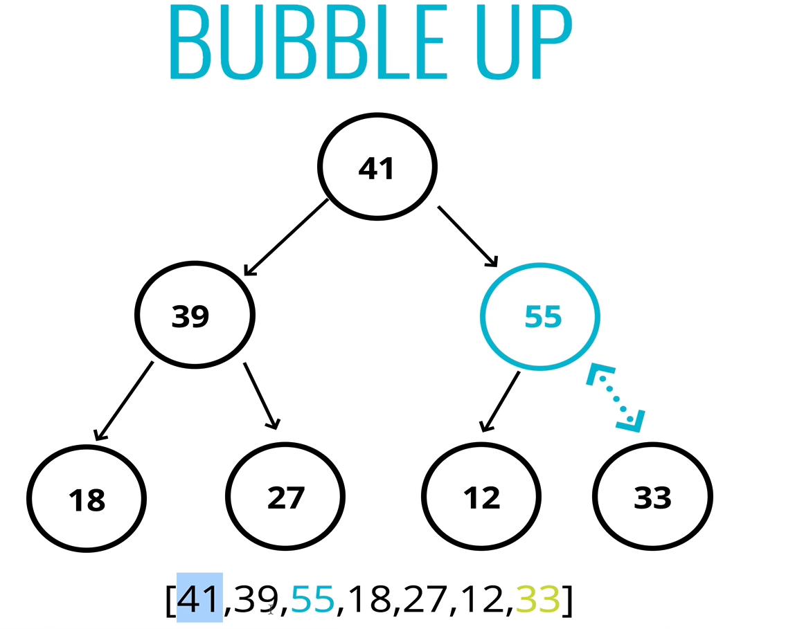

# BINARY HEAPS

(heaps - anohter category of trees)

A binary heap is a data structure that takes the form of a binary tree. Binary heaps are a common way of impementing priority queues. Introduced by J. W. J. Williams in 1964, as a data structure for heapsort. (-wikipedia)

Binary heap is defined as a binary tree with two additional constraints:

- Sape property: a binary heap is a complete binary tree; that is, all levels of the tree, except the last one (deepest) are fully filled, and, if the last level of the tree is not complete, the nodes of that level are filled from left to right.

- Heap property: the key stored in each node is either greater than or equal to or less than or equal to the keys in the node's children, according to some total order.

Heaps where the parent key is greater than or equal to the child keys are called max-heaps;
Those where it is less than or equal to are called min-heaps.

A binary heap is as compact as possible. All the children of each node are as full as they can be and left children are filled out first.

They are also used quite a bit, with graph traversal algorithms.

### Correct example of a heap

### Not a heap, but a binary search tree

### A max-heap

## Representing a heap

## To add a new Element then bubble up (swap)

## Removing from a Heap

The procedure for deleting the root from the heap (effectively extracting the maximum element in a max-heap or the minimum element in a min-heap) and restoring the properties is  called down-heap ( also known as bubble-down, percolate-down, sift-down, trickle down, heapify-down, cascade-down, and extract-min/max)

removing from a max heap;

# PRIORITY QUEUE

#### What is a priority Queue?
- A data structure where each element has a priority.
- Elements with higher priorities are retrieved before elements with lower priorities.
- Priority keys are separate from heaps, It can be implemented using arrays or lists.

## Big O of Binary Heaps

### Worst and  best case
### - Insertion - O(Log N)
### - Removal - O(Log N)
### - Searching - O(N)