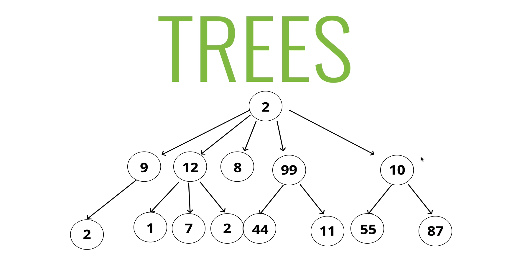

# TREES

A data structure that consists of Nodes in a parent/ child relationship

It has a root, and references 0 or multiple nodes.

## Tree Terminology
- Root - The top node in a tree.
- Child - A Node directly connected to another node when moving away from the Root.
- Parent - The converse notion of a child.
- Siblings - A group of nodes with the same parent.
- Leaf - A node with no children.
- Edge - Thte connection between one node and another.

#### Lists - linear
#### Trees - Nonlinear

 

### This is not a tree

### Lots of different applications!

#### HTML DOM (Document Object Model)
#### Network Routing 
#### Abstract syntax Tree (a way of describing the syntax of a programming language using tree structure)
#### Artifical Intelligence 
#### Folders In Operating System
#### Json (JavaScript Object Notation)
#### more...

### KIND OF TREES
- Binary Trees
- Binary Search Trees (sometimes called Ordered or Sorted binary trees)
    At most have 2 children
    Every node to the left of a partent node is always less than the parent
    Every node to the right of a parent node is always greater than the parent

# Big O of BST

- Insertion - O(log n)
- Searching - O(log n)
