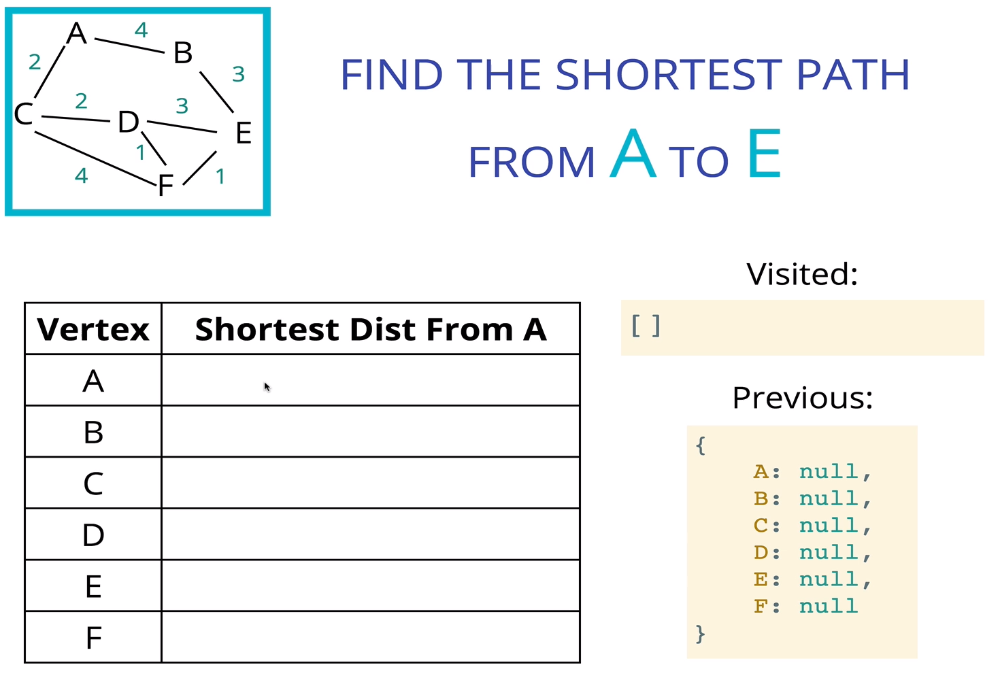

# DIJKSTRA'S ALGORITHM (Shortest path algorithm)

One of the most famous and widely used algorithms around.
Finds the shortest path between two vertices on a graph
"What's the fastes way to get from point A to point B?"

## Edsger Dijkstra

was a Dutch programmer, physicist, essayist, and all around smarty-pants
He helped to advance the field of computer science from an "art" to an academic discipline
Many of his discoveries and algorithms are still commonly used to this day.

## Why is it useful?

- GPS - finding fastest route
- Network Routing - finds open shortest path for data
- Biology - used to model the spread of viruses among humans
- Airline tickets - finding cheapest route to your destination
- many other uses!

## The Approach

- Use a weighted graph
- Every time we look to visit a new node, we pick the node with the smallest known distance to visit first.
- Once we've moved to the node we're going to visit, we look at each of its neightbors
- For each neighboring node, we calculate the distace by summing the total edges that lead to the node we're _checking from the starting node._
- If the new total distace to a node is less than the previous total, we store the new shorter distance for that node.

- Graphs are collections of vertices connected by edges
- Graphs can be represented using adjacency lists, adjacency matrices and quite a few other forms.
- Graphs can contain weights and directions as well as cycles
- Just like trees, graphs can be traversed using BFS and DFS
- Shortest path algorithms like Dijkstra can be altered using a heuristic to achieve better results like those with A\*
