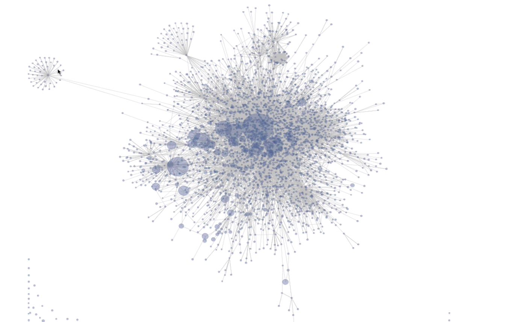

# GRAPH TRAVERSAL

#### PREREQUISITES
- BIG O NOTATION
- RECURSION
- BINARY SEARCH TREES
- TREE TRAVERSAL
- GRAPHS

### TRAVERSAL = visiting / updating / checking each vertex in a graph.

### GRAPH TRAVERSAL USES
- ### Peer to peer networking
- ### Web crawlers
- ### finding "closest" matches/ recomendations
- ### Shortest path problems
    - GPS Navigation
    - Solving mazes
    - AI (Shortest path to win the game)

## DEPTH FIRST
Explore as far as possible down one branch before "bracktracking" 

## BREATH FIRST
Visit neighbors at current depth first!