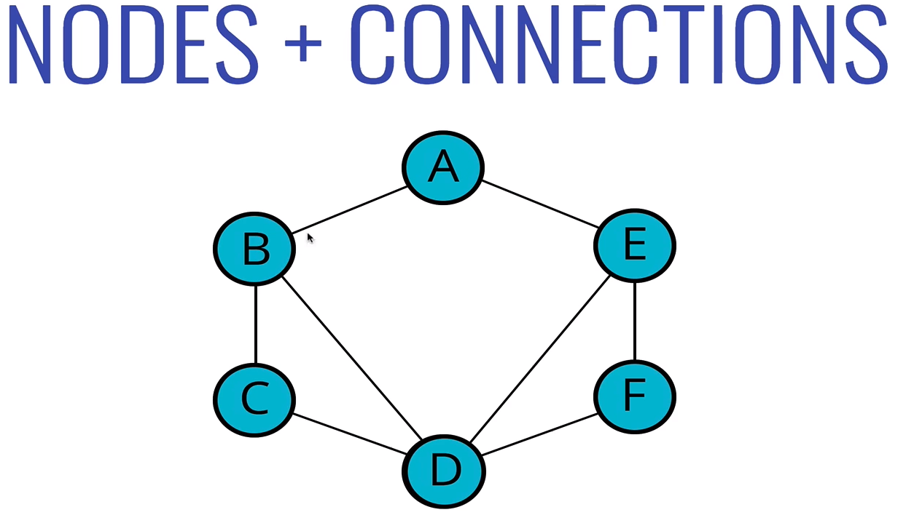
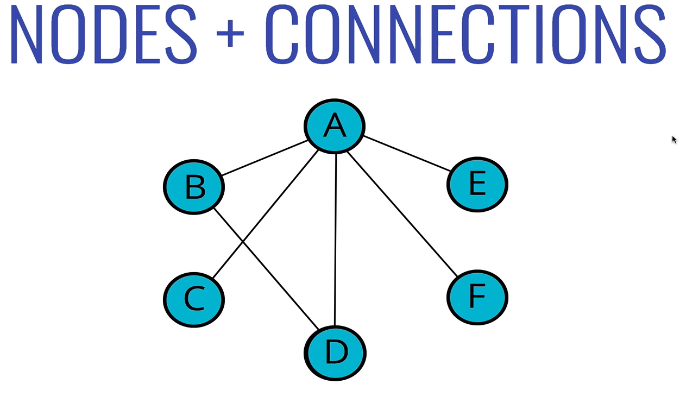
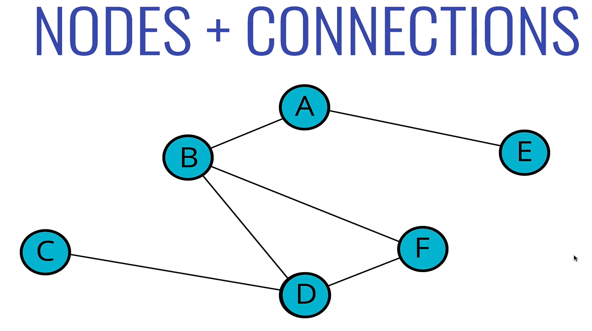
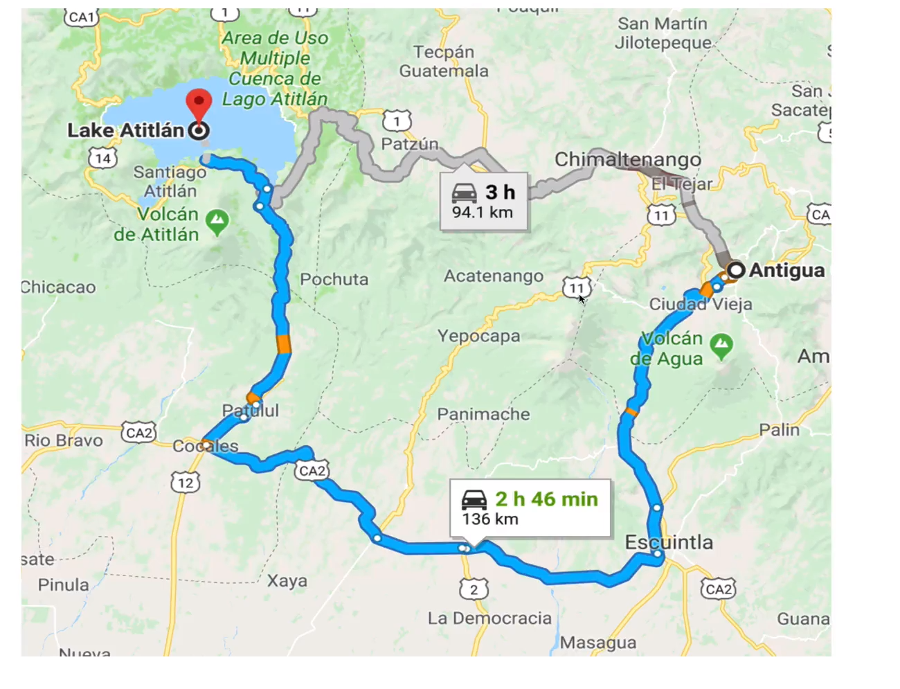
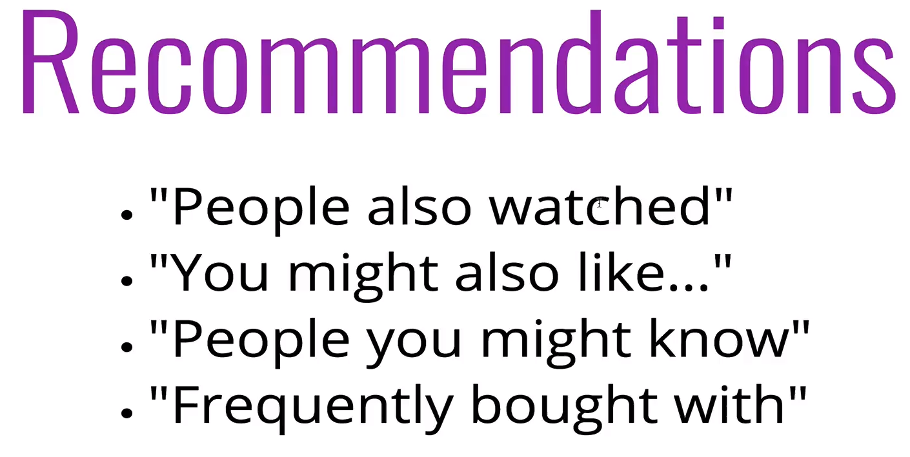
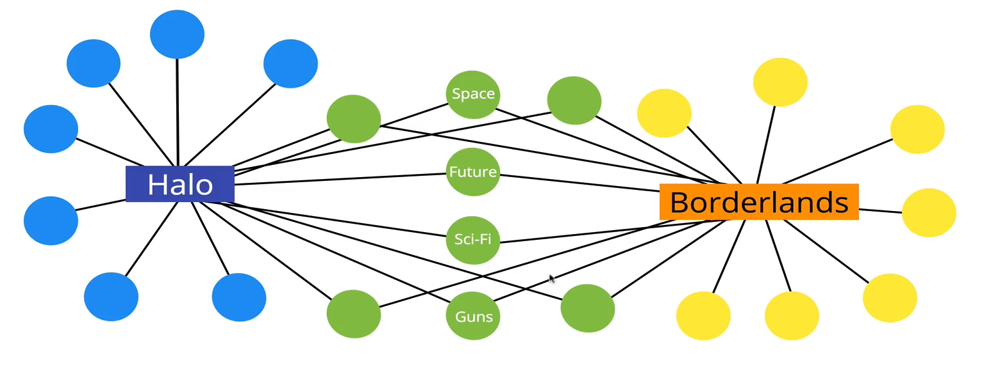
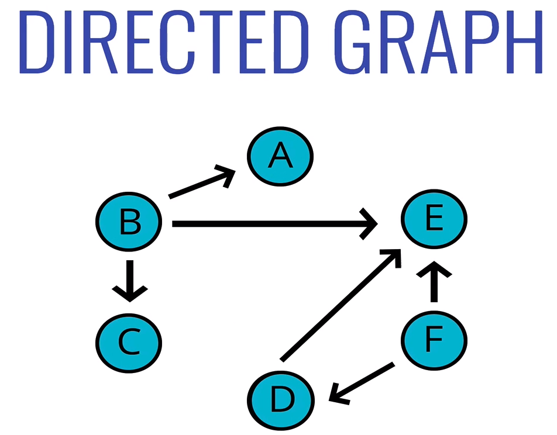
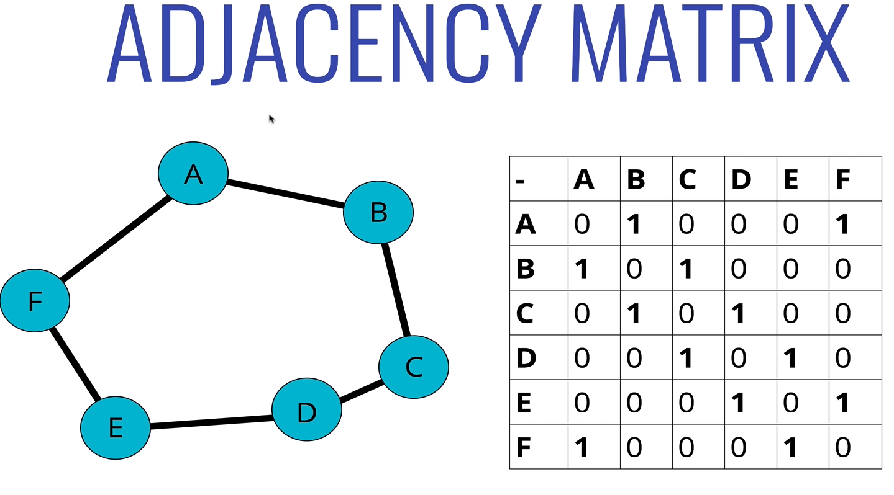
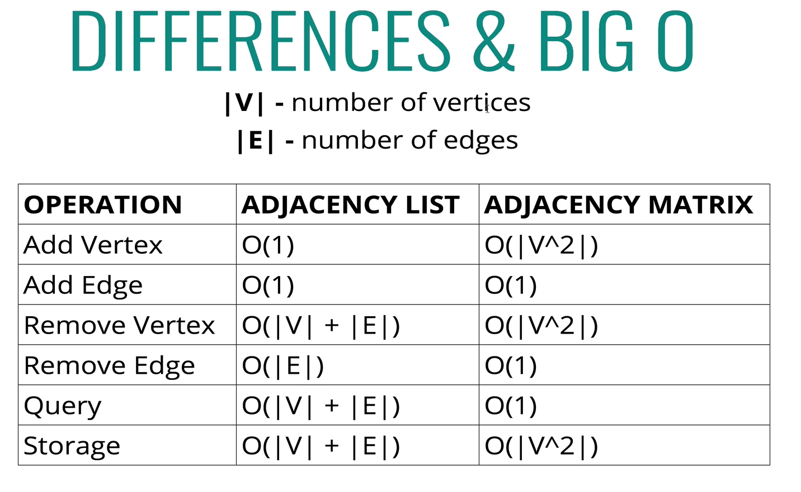

# GRAPHS 

### A graph data structure consists of finite (and possibly mutable) set of vertices or nodes or points, together with a set of unordered pairs of these vertices for an undirected graph or a set of ordered pairs for a directed graph

- ### Collection of nodes and connection between those nodes.

## USES

- ## Social Networks 
- ## Location / Mapping
- ## Routing Algorithms
- ## Visual Hierarchy
- ## File System Optimizations
- ## Everywhere!

## TYPES OF GRAPHS

- ## Vertex - a node
- ## Edge - connection between nodes
- ## Weighted/ Unweighted - values assigned to distances between vertices
- ## Directed/ Undirected - directions assigned to distanced between vertices

- Undirected Graph, there is no direction or polarity to the edges.
- A tree is an undirected graph in which any two vertices are connected by exactly one path.

- Directed Graph, often represented with arrows which represents the direction or polarity of that edge

# Storing graphs

- Takes up more space (in sparse graphs)
- Slower to iterate over all edges

- Faster to lookup specific edge

- ## Adjacency Matrix
A matrix, a two dimensional structure 

- ## Adjacency List

- Can take up less space (in sparse graphs)
- Faster to iterate over all edges

- can be slowwer to looup specific edge

# Differences & Big O

