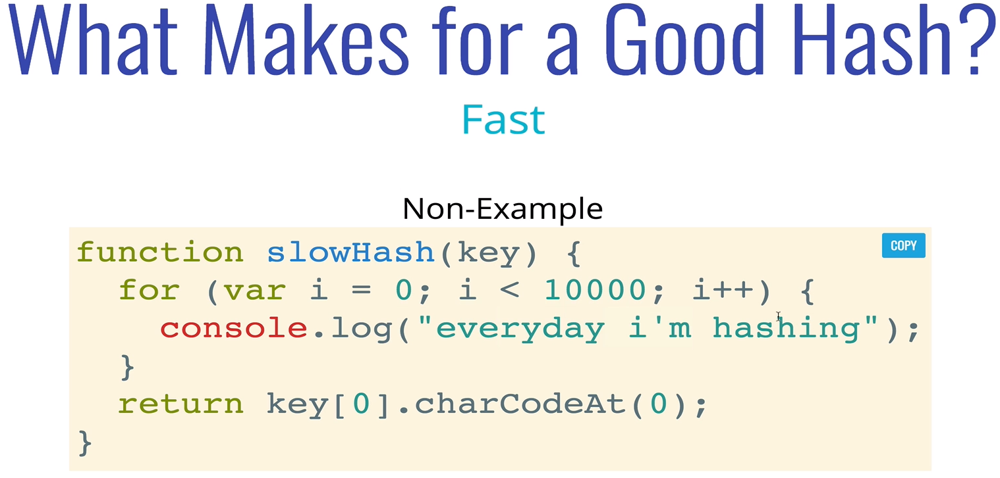
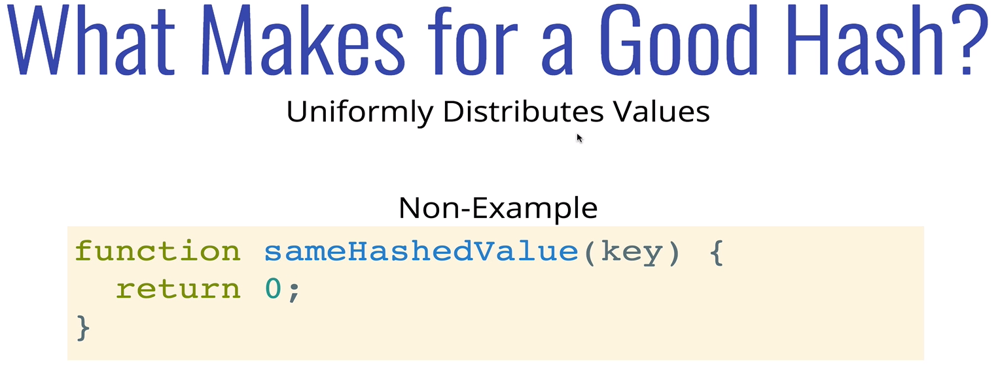
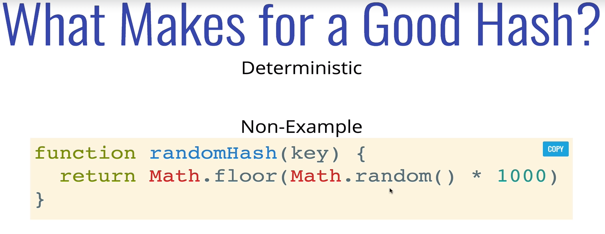
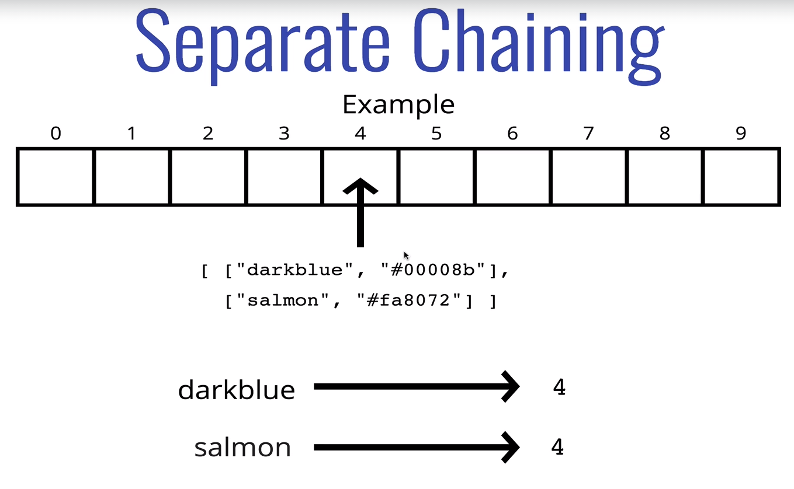
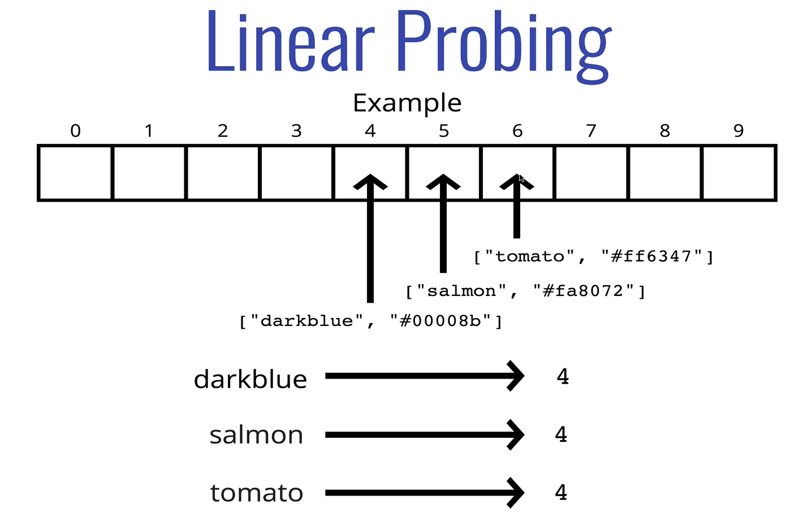
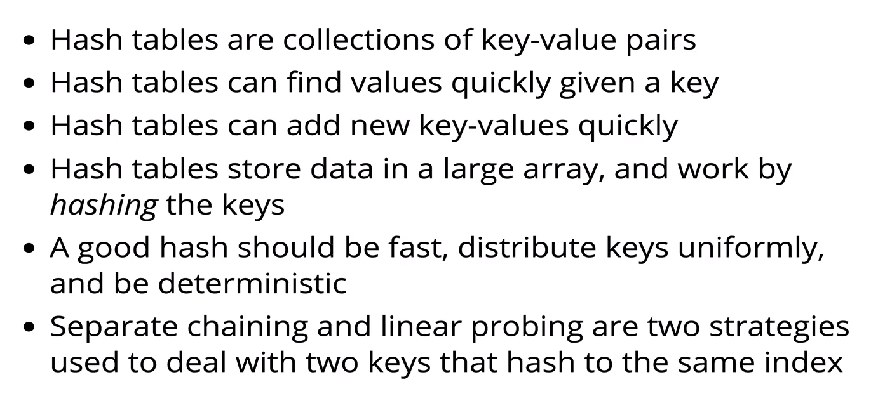

# HASH TABLES 
#### Also known as hash maps. most languages has a built in hash table or hash map.

- ### Hash tables are used to store key-value pairs.(are collections of key-value pairs)
- ### They are like arrays, but the keys are not ordered
- ### Unlike arrays, hash tables are fast for all of the following operations: finding values, adding new values, and removing values!

- Python has Dictionaries
- JS has Objects and Maps* ()
- Java, Go, & Scala have Maps
- Ruby has... Hashes

** Objects have some restrictions, but are basically hash tables.

In order to look up values by key, we need a way to convert keys into valid array indices.
A function htat performs this task is called a hash functiion.

### Hash Function

A hash function is any function that can be used to map data of arbitrary size to data of a fixed size. The values returned by a hash function are called hash values, hash codes, digests, or simply hashes.  Hash functions are often used in combination with a hash table, a common data structure used in computer software for rapid data lookup. Hash functions accelerate table or database lookup by detecting duplicated records in a large file. One such application is fincing similar stretches in DNA sequences. 

### Uses
- Hash tables
- Caches
- Boom filters
- Finding duplicate records
- Protecting data
- crypto currency
- etc...

### What makes a good hash?
 - Fast (i.e constant time)
 - Doesn't cluster outputs at specific indices, but distributes uniformly
 - Deterministic (same input yields same output)

### This are bad examples

--------------------------------------------
the prime number in the hash is helpful in spreading out the keys more uniformly

it's also helpful if the array that you're putting values into has a prime length.

--------------------------------------------

## Dealing with Collisions

Even with a large array and a agreat hash function, collisions are inevitable
There are many strategies for dealing with collisions, but we'll focus on two:

1. Separate chaining
    At each index in our arrray we store values using a more sophisticated data structure (e.g. an array or a liked list).
    This allows us to store multiple key-value pairs at the same index.
    
2. Linear Probing
    When we find a collision, we search through the array to find the next empty slot.
    Unlike with separate chaining, this allows us to store a single key-value at each index
    

#   BIG O of HASH TABLES (average case)

- Insert: O(1)
- Deletion: O(1)
- Access: O(1)

