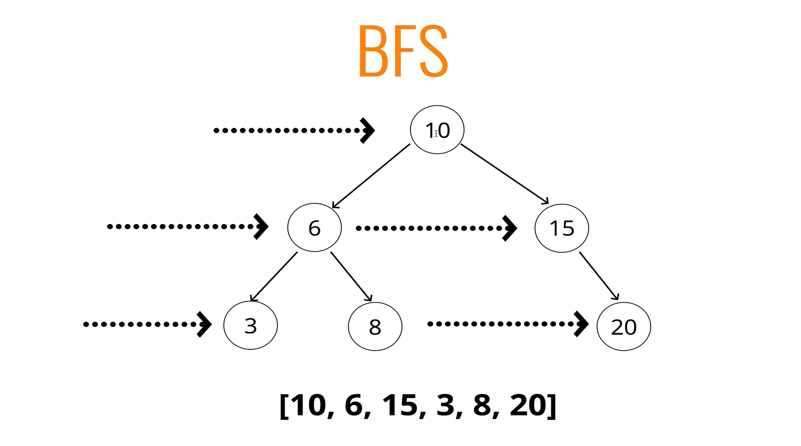
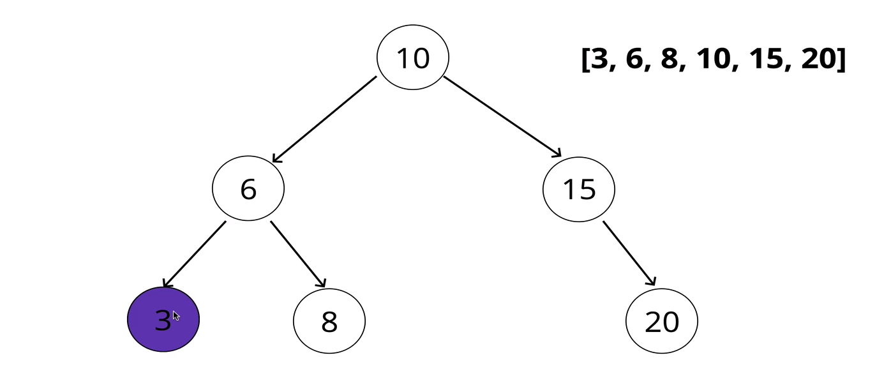
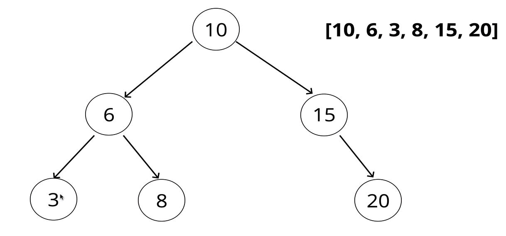
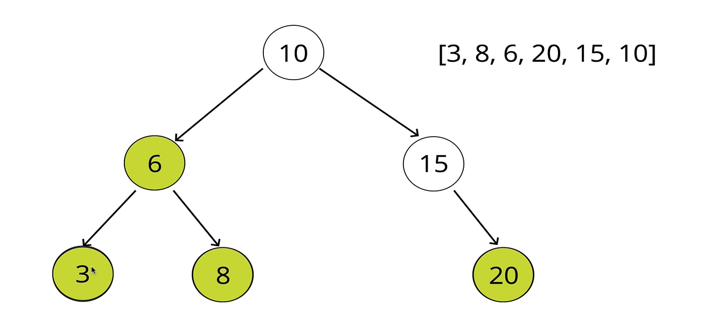

# TREE TRAVERSAL

## Traversing A Tree

### Two Ways:
- ### Breadth-first Search
- ### Depth- first Search

##  BFS (Breadth-First Search)
Going across
means - visiting every node in the same level (siblings) before diving into a child node.

### Steps - Iteratively
- Create a queue (this can be an array) and a variable to store the values of nodes visited
- Place the root node in the queue
- Loop as long as there is anything in the queue
    - Dequeue a node from the queue and push the value of the node into the variable that stores the ndoes
    - If there is a left property on the node dequeued - add it to the queue
    - If there is a right property on the node dequeued - add it to the queue
- Return the variable that stores the values

## DFS (Depth-First Search)

#### 3 different ways:

- #### InOrder
- visit node first (add to list, print out);
- then explore everything on left before exploring the right.

- #### PreOrder
- explore everything on the left;
- visit node ( add to list, print out);
- explore everything on the rigtt;

- #### PostOrder
- Explore every child first, from left to right;
- add the value of the parent after it has explored all childs;

